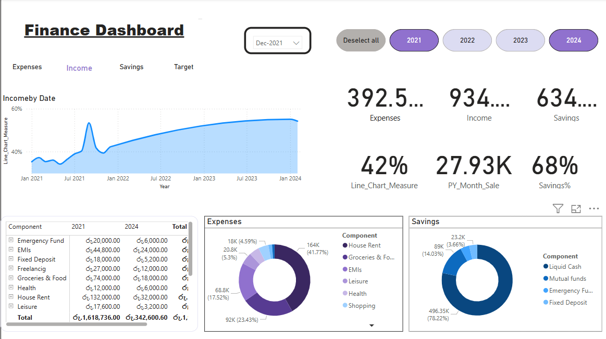

#  Personal Financial Dashboard

This Power BI dashboard provides a comprehensive view of personal financial data including savings, expenses, and economic trends over time. Designed for individuals seeking to track, visualize, and manage their finances with clear and interactive visual representations.

---

##  Features

- **Card Format** displaying yearly:
  -  **Savings**
  -  **Economy**
  -  **Expenses**

- **Line Chart** showing trends over time for:
  - Savings  
  - Expenses  
  - Economy  
  - Financial Target  

- **Monthly Sales Overview**  
  - Analyze sales patterns by **month** and **year**

- **Donut Charts** visualizing:
  - Yearly breakdown of **expenses**
  - Yearly breakdown of **savings**

- **Component Totals by Year**  
  - Aggregated financial figures for each year across key metrics

---

##  File Contents

- `Personal-Financial-Dashboard.pbix` – Power BI file containing the full interactive dashboard

---

##  How to Use

1. Open the `.pbix` file in **Microsoft Power BI Desktop**
2. Interact with filters and visuals to explore your financial trends
3. Customize data sources if needed to reflect your own financial data

---

##  Requirements

- [Power BI Desktop](https://powerbi.microsoft.com/desktop/) (latest version recommended)

---

##  Preview

